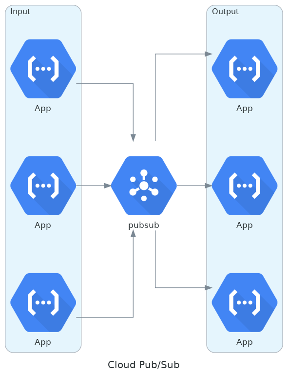
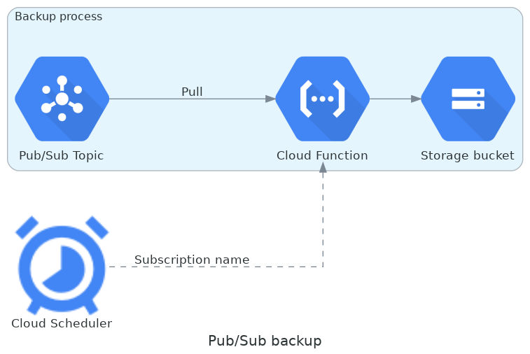

# Operational Data Hub

The Operational Data Hub implements an enterprise application integration architecture in which a central data hub 
facilitates all applications to connect and exchange data. This central data hub serves as the all-inclusive source of 
truth, capturing all information and business events, enabling the data-driven enterprise.

## Table of contents
1. [Principles](#principles)
    1. [Open Source](#open-source)
    2. [Software-defined](#software-defined)
    3. [Serverless](#serverless)
    4. [Security by design](#security-by-design)
    5. [Data integrated](#data-integrated)
2. [Components](#components)
    1. [Pub/Sub](#pubsub)
    2. [Data catalog deployment](#data-catalog-deployment)
    3. [Backup](#backup)
3. [References](#references)

## Principles
The Operational Data Hub, hereafter called “ODH”, is built from the ground up based on six basic principles. These 
principles define all conceptual ideas and functional implementations the function exists of and are used within 
further innovations of the hub.

### Open Source
First and foremost the ODH is fully based on and defined by Open Source Software, hereafter called “OSS”. This type 
of software is meant to  “. . . promote collaboration and sharing because they permit other people to make modifications 
to source code and incorporate those changes into their own projects” (Opensource.com, n.d.). By releasing all ODH 
related software as OSS, the ODH becomes a space where everybody is free to participate and enhance the software in 
unanticipated ways. Besides, the OSS distribution will enable the possibility to incorporate other OSS into its core 
to improve the quality and functionalities based on the work of millions of contributors. 

### Software-defined
Another important principle of the ODH is that it is fully software-defined. This is a concept that refers to the 
ability to control some or all of the functions of a system using software. By becoming software-defined, the ODH 
enjoys major systemic benefits, including lower costs, higher quality products and services, and less risk. Within 
our environment, we strive to add, edit and delete everything we do via software to make sure the process can be 
repeated endlessly and includes minimal space for user errors.

### Serverless
To ensure the ODH will benefit from the innovations and strength of the Cloud, making it serverless was the only way. 
Serverless computing is an execution model for the cloud in which a cloud provider dynamically allocates—and then 
charges the user for—only the compute resources and storage needed to execute a particular piece of code. Naturally, 
there are still servers involved, but their provisioning and maintenance are entirely taken care of by the provider. 
The advantage of running serverless is that developers can focus on writing functional and innovative code instead of 
creating, maintaining and improving their own servers. Furthermore, pay-per-use helps with developing new and creative 
ideas without having to allocate servers. This empowers the strength of the ODH and will ensure the focus will lie fully 
on the further development of components and functionality.

### Security by design
Security by design is an approach that seeks to make systems as free of vulnerabilities and impervious to attack as 
possible through such measures as continuous testing, authentication safeguards and adherence to best programming 
practices. Security is not added afterwards or as a separate asset, but it is built-in in software, systems
development life cycle (SDLC) and developers’ minds.

### Data integrated
One of the strongest aspects of an ODH is the full data integrated structure. This integration involves combining data 
from several disparate sources, which are stored using various technologies and provide a unified view of the data. 
We strive to not lock-up our data in applications and data silo’s, but make it available and share it. This sharing of 
data enables new insights that will be used for improvements and innovations with the platform but also the business it 
is used in. The ODH uses a flexible data model to handle all data types without limitations.

## Components
The Operational Data Hub, hereafter “ODH”, consists of some fundamental components that combine the flexibility
provided by the cloud platform and the strength of the code itself. These components are made to be flexible, 
scalable and fully generic. Before explaining how all of these components are intertwined with each other to create 
the ODH, each component will be individually described.

### Pub/Sub
The most important component of the ODH is Google Cloud Pub/Sub. The hub is fully built on and around this service 
provided by the Google Cloud Platform, hereafter called “GCP”. As explained by Qwiklabs (2020), ”Google Cloud Pub/Sub 
is a messaging service for exchanging event data among applications and services. By decoupling senders and receivers, 
it allows for secure and highly available communication between independently written applications.” Pub/Sub can be 
compared to Apache Kafka; a publish-subscribe based durable messaging system. This messaging system is a central hub 
via which multiple applications communicate with each based on event-driven messages.

Pub/Sub exists of two key components: topics and subscriptions. A topic can have multiple subscriptions that each have 
their purpose. A message is published by a publisher towards a topic where it is added to the end of the message-bus. 
Thereafter, each subscription can process the message in their way. Some subscriptions need a function (a subscriber) 
to retrieve the data, where some push data towards certain functions, applications or databases. Because a topic can 
have “endless” subscriptions, the scalability is enormous and each message can be used by different processes.

  

As seen in the example above, Cloud Pub/Sub is the connection between different applications, functions and databases. 
This centralized hub to navigate all data through is the strength of the ODH; all data passes through one place that 
enables easier connections between applications and a single source of truth, hereafter called “SSOT”. This SSOT enables 
the platform to not only provide a dynamic state of the art infrastructure but also endless possibilities for data 
research to optimize and innovate.

### Data catalog deployment
Another essential component of the ODH is the data catalog deployment. This is a fully automated deployment for all 
resources in and around the ODH based on data catalogs; “. . . a detailed inventory of all data assets in an 
organization, designed to help data professionals quickly find the most appropriate data for any analytical or 
business purpose” (IBM Cloud Education, 2020). Within the ODH the data catalog has two goals: to maintain a detailed 
inventory of all data assets and to automatically deploy assets based on that information. This ensures that the 
information added to the catalogs is always up-to-date. Because of the “endless” scalability of the ODH, the data stored 
inside the hub can grow exponentially. To keep this in control, an extensive catalogue is needed to maintain insight 
into the data. 

The data catalogs are based on Project Open Data; a collection of code, tools and case studies commissioned by The 
White House to “. . . support the implementation of policy, the creation of data governance structures, and the 
day-to-day work of data management in the federal government” (The Federal Enterprise Data Resources, n.d.). Within 
this project, a schema definition is defined to create a generic set of information on each asset 
(https://vwt-digital.github.io/project-company-data.github.io/v1.1/schema/). This schema contains all fields to describe 
datasets, but also to deploy these datasets to the cloud with the Data catalog deployment functions.

### Backup
When creating an infrastructure where enormous amounts of data pass through, a good data loss prevention 
(hereafter “DLP”) program is crucial. Within the ODH we’ve integrated fully automated backup processes. These backup 
processes use the built-in services of the Cloud platform to retrieve, process and store the data.

  

One of the backup processes is the Pub/Sub backup, as displayed above. This process retrieves all messages stored 
within a Pub/Sub topic and copies them towards a Google Cloud Storage, hereafter “GCS”, bucket. The Cloud Scheduler 
triggers a Cloud Function what then starts te backup-process. By using a scheduler, this process can run automatically 
in the background 24/7 and ensures up-to-date data. In case of data loss, the storage will always contain a history of 
messages that can be restored at any time.

## References
- IBM Cloud Education. (2020, April 3). Data Catalog. Retrieved August 12, 20202, from 
https://www.ibm.com/cloud/learn/data-catalog
- Opensource.com. (n.d.). What is open source? Retrieved July 30, 2020, from 
https://opensource.com/resources/what-open-source
- Qwiklabs. (2020, January 10). Introduction to Google Cloud Pub/Sub. Retrieved August 10, 2020, from 
https://medium.com/@qwiklabs/introduction-to-google-cloud-pub-sub-fce6a31aea9
- The Federal Enterprise Data Resources. (n.d.). Data management & governance. Retrieved August 12, 2020, from 
https://resources.data.gov/categories/data-management-governance/
