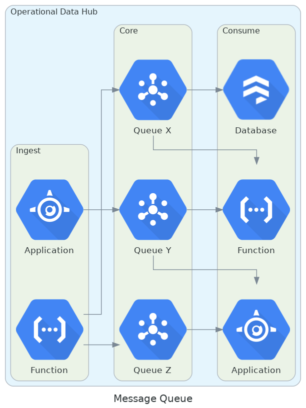
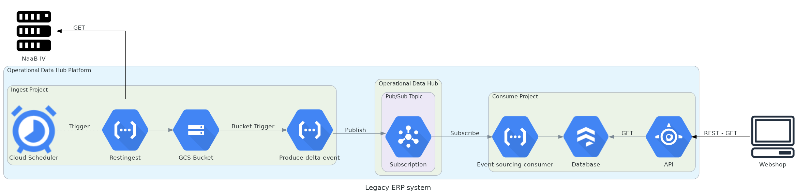

# Operational Data Hub

The Operational Data Hub implements an enterprise application integration architecture in which a central data hub 
facilitates all applications to connect and exchange data. This central data hub serves as the all-inclusive source of 
truth, capturing all information and business events, enabling the data-driven enterprise.

## Table of contents
1. [Introduction](#introduction)
2. [Use cases](#use-cases)
    1. [Legacy ERP system](#legacy-erp-system)
    2. [Renewal of third-party licenses](#renewal-of-third-party-licenses)
    3. [Customer support mailbox](#customer-support-mailbox)
    4. [Data science](#data-science)
    5. [Current stock](#current-stock)
    6. [Available data](#available-data)

## Introduction
This documentation is meant to explain what the Operational Data Hub (hereafter "ODH") is, what it can provide and how 
it can be used.

As described above, the ODH is a central hub for an all-inclusive source of truth by facilitating applications to 
connect and exchange data. The exchange of this data is done via a so-called message queue.

  

As seen in the diagram above, functions, applications, databases and more can post messages to different queues, where 
other resources can retrieve them. This concept empowers users to unlock more possibilities by having the data at a 
centralised place. From here, the data can be analysed, more applications can be connected with each other without 
creating a spider web and all infrastructure components can be managed via one single access point: the ODH.

But creating a centralised place for all data is not the only strength of the ODH. In addition, the creation and 
maintenance of this hub are fully automated and manageable through data catalogs. These are detailed inventories of all 
data assets in an organization, designed to help data professionals quickly find the most appropriate data for any 
analytical or business purpose. But providing the location of the data is not the only reason, it also unlocks the 
automated deployment of these resources. The ODH can be fully managed by creating and editing these catalogs, where 
resources can be defined, security can be organized and data can be structured. 

> To learn more about the automated deployment via data catalogs, visit our 
>[data-catalog deployment repository](https://github.com/vwt-digital/dcat-deploy).

## Use cases
To describe how the ODH can be used in different ways we’ve created some use cases which will provide handles for the 
usage of the ODH. The use cases are created for a fictional software license and computer parts webshop. The fictional 
webshop has a decentralised application landscape and must innovate to get more value from their data. The use cases 
describe how the ODH can improve efficiency and data-value based on the current webshop systems.

### Legacy ERP system
The original webshop was based around BaaN IV, an enterprise resource planning (ERP) system popular during the early 
nineties. During the transition to a new and more modern webshop, the connection with BaaN IV needed to be preserved 
because of the importance of the data. Within BaaN IV all logistic, administrative and financial business processes are 
processed and maintained. But because this is a legacy system, the data within BaaN IV is hard to reach and data science 
is second to none.

#### Schema
This is where the ODH will come in. Because of the versatility of the hub, even the oldest legacy systems can still be 
a part of the application landscape. To provide you with an overview of how the ODH will be at the centre of this 
solution, the supposed schema is defined below.

  

As the schema shows, the solution consists of seven components divided over two objects, consume and ingest, and the
external BaaN IV server. 

#### Components
Below is the list of components used in this solution with references to documentation.

Name | Type | Documentation
--- | --- | ---
Cloud Scheduler | Cloud Scheduler | https://cloud.google.com/scheduler
Restingest | Cloud Function | https://github.com/vwt-digital/restingest
GCS Bucket | GCS Bucket | https://cloud.google.com/storage/docs/key-terms#buckets
Produce delta event | Cloud Function | https://github.com/vwt-digital/event-sourcing-helpers/tree/develop/functions/produce_delta_event
Pub/Sub Topic | Pub/Sub Topic | https://cloud.google.com/pubsub/docs/overview
Event sourcing consumer | Cloud Function | https://github.com/vwt-digital/event-sourcing-consumers
Database | Firestore | https://cloud.google.com/firestore/docs

#### Functionality
##### Consume
Within the consuming part of the solution, the data will be retrieved from the server and posted towards a 
[Pub/Sub topic](https://cloud.google.com/pubsub/docs/overview) (the Google Cloud Platform message queue). But before the 
data is posted towards the topic, some steps have to be taken. At first, an automated 
[Cloud Scheduler](https://cloud.google.com/scheduler) will tell the Restingest function to go to work. This is a generic
HTTP endpoint that can retrieve documents from an external server and store them on a 
[Google Cloud Storage Bucket](https://cloud.google.com/storage/docs/key-terms#buckets) (hereafter “GCS”). For a more 
detailed description of how to use this awesome function, please visit the [Restingest repository](https://github.com/vwt-digital/restingest). 
In this case, the Restingest will request data from BaaN IV and store it inside a GCS Bucket.

After the upload has finished, a [Bucket trigger](https://cloud.google.com/functions/docs/calling/storage) will trigger
the [Produce delta event function](https://github.com/vwt-digital/event-sourcing-helpers/tree/develop/functions/produce_delta_event). 
This function retrieves the data it triggered on and will check the difference (a delta) between the last known file in 
the bucket. All changes will be published towards the Pub/Sub Topic as single messages.

##### Ingest
After the new data entities are published towards the Pub/Sub Topic, a [consume function](https://github.com/vwt-digital/event-sourcing-consumers) 
will retrieve these messages one at a time and inserts them into a database. In this example, a 
[Firestore database](https://cloud.google.com/firestore/docs) is used, but the function can be changed to any database 
available on the platform.

### Renewal of third-party licenses
As described before, our fictional webshop sells third-party licenses that are controlled by third-party companies. 
One of these companies, Adobe, has an API where new licenses can be requested and existing licenses can be renewed or 
cancelled. Currently, the requests for these licenses is done directly by the API used within the webshop and some form 
of auditing is limited. Furthermore, the API’s are fully intertwined with each other and potential changes are near 
impossible.

#### Schema
To show how the ODH can be a central place to request new and update existing licenses, we’ve created a schema showing 
the potential infrastructure setup.

  

Within this schema, two route-types are possible:
1. Posting towards the external API (orange route). E.g.: requesting a new license, updating existing licenses or 
cancelling a license;
2. Receiving from the external API (grey route). E.g.: receiving updates for a license.

#### Components
Below is the list of components used in this solution with references to documentation.

Name | Type | Documentation
--- | --- | ---
Client | App Engine | https://cloud.google.com/appengine/docs/the-appengine-environments
API | App Engine | https://cloud.google.com/appengine/docs/the-appengine-environments
Database | Firestore | https://cloud.google.com/firestore/docs
Pub/Sub Topic | Pub/Sub Topic | https://cloud.google.com/pubsub/docs/overview
Restingest | Cloud Function | https://github.com/vwt-digital/restingest
Consume | Cloud Function | https://github.com/vwt-digital/event-sourcing-consumers

#### Functionality
As described, there are two routes possible: requesting or receiving data about licenses.

##### Posting (orange route)
The first flow of this implementation is posting data for licenses. Within this flow, the Client (front-end application,
e.g. an [App Engine](https://cloud.google.com/appengine/docs/the-appengine-environments)) requests a new license or an 
update or cancellation on an existing license. Within this example, we will request a new license. This Client-request 
will be processed by the API and continues in two directions: at first, the database (e.g. 
[Firestore](https://cloud.google.com/firestore/docs)) will be updated with the desired information. Here the API could 
add data about a new, not yet existing, license. Concurrent, the API will post a message towards a 
[Pub/Sub topic](https://cloud.google.com/pubsub/docs/overview) (the Google Cloud Platform message queue) containing the 
request for a new license. This will be picked up by an alternative Cloud Function, in this case, the 
[Restingest](https://github.com/vwt-digital/restingest), that will communicate with the Abobe API. Within this 
communication, the function will post a request for a new license, where the Adobe API will respond with either 
information about the new license or a message about a denied request. After receiving, the function posts this response
to a Pub/Sub Topic once again. This message will be picked up by a third function thas processes it and adds the desired
information to the database.

One of the advantages of this implementation is the concurrency of the flow; after the API has posted the message 
towards the Pub/Sub Topic, it can finish the communication with the front-end. This because the Pub/Sub flow is fully 
disconnected from the API. The next time the API will request information about the license, it can check the database 
whether the license is created and active or if it is still processing.

##### Receiving
Next to sending information towards the external API, receiving updates about licenses can also be implemented into the 
ODH. As seen in the diagram, the flow from the Adobe API is identical as described with posting information towards the 
API. In this case, the Adobe API sends updates or events towards a configured endpoint; the Restingest function. This 
function will process the message and uses the Pub/Sub Topic to sent it towards the database. This flow can be used if 
Adobe has updated information about licenses, or something is wrong with a license. It can send the message towards the 
endpoint and the database will automatically update.

### Customer support mailbox
A webshop is only as good as it’s customer support. Currently, a mailbox is used for the customer support where 
employees check and process incoming mails. These mails have to be manually connected to a certain order or inquiry, 
which costs employees a lot of time. An automated system processing and connecting these mails is desirable.

[TO BE CONTINUED]

### Data science
Because the market for webshops is packed you have to stand out. Currently, the webshop does not have any unique selling 
point other than a wide range of licenses and computer parts. The solution for this is data science; analyzing and 
mapping user activity can help by expanding the business. Right now there is not any data science opportunity as the 
data is very fragmented.

[TO BE CONTINUED]

### Current stock
The stock of computer parts is controlled by the warehouse from third-party sellers and the sales on the webshop. The 
manufacturer where most of the parts are from has a system that notifies the current stock of the warehouse. At the 
moment the webshop shows the current stock, but this is done manually by employees based on the information of the 
third-party’s selling the products. By automating this, the employees can focus on improving other areas of the business.

[TO BE CONTINUED]

### Available data
After making sure the data is reachable a new data scientist is hired to make use of the data. But before this employee 
can do his magic, a clear overview of the data is necessary. This to make it easier for the new employee but also to 
help to substantiate the use of data in line with the General Data Protection Regulation (GDPR).

[TO BE CONTINUED]
