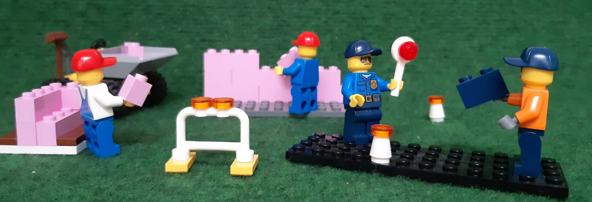

# 38. SAST and DAST are in the CI/CD pipeline

Date: 2020-09-21

## Status

Accepted

Implements [6. Implement Security by Design](0006-implement-security-by-design.md)

## Context

Developers tend to go for getting things working, ending up with a working program, lacking the quality you would like to see.

Quality software is not only software that is doing what it should do. Next to the functionality, a maybe even larger amount of non-functional requirements determine the quality of software. The ISO/IEC 25010 software quality model describes performance, compatibility, portability, usability, reliability, security and maintainability as additional aspects of software quality (1). But assuring the required quality in all of these aspects appears to be hard when finishing the last few lines of code of the new feature at the end of a long working day.

The result of low quality software can be performance issues, increased maintenance cost, bugs, difficulty in changing the software and security vulnerabilities. These are all things you would rather avoid, but that requires building good quality software. So, despite high workload and despite the urge to finish that new feature today, we do not want anyone to write low quality code. How to stop a developer from doing that?

_The only way to stop a developer is to break the build!_

Every time new code is written and added to the program, the build pipeline is running, a practice known as continuous integration (2). The build pipeline builds the program and runs various checks to see if the program is behaving according to the requirements. If something is wrong, the build pipeline will stop and report about the problem, which is referred to as a broken build. The problem will have to be fixed first to get to a successful build.

So if we want to stop a developer from writing low quality code, we must make sure the build breaks as soon as low quality code is added. Therefore, we add build-breaking checks (build-breakers), to the build pipeline that check the quality of the code added to the program. Examples of these checks are _static application security tests (SAST)_, which examine the programming code for security issues, static code analysis, which check for coding style and coding issues, _dynamic application security tests (DAST)_, which examine the running program for security issues, _unit tests_, which automatically perform small tests on the program, _fuzzing tests_, which send random input to the program and check for unwanted behaviour, _performance tests_ and _end-to-end tests_, which test the program as a whole.

## Decision

We will add build-breakers to the build pipeline performing SAST and DAST scans and also other non-security checks.

## Consequences

### Advantages

* Fast feedback to developer, helping to build quality in.
* Hard to deploy low-quality code.
* Leverage on tools available to prevent security vulnerabilities.

### Disadvantages

* Potentially longer build time.
* Low priority issues could delay bug fixes.

## References

1. https://iso25000.com/index.php/en/iso-25000-standards/iso-25010, retrieved 23 October 2020
2. https://martinfowler.com/articles/continuousIntegration.html, retrieved 23 October 2020
